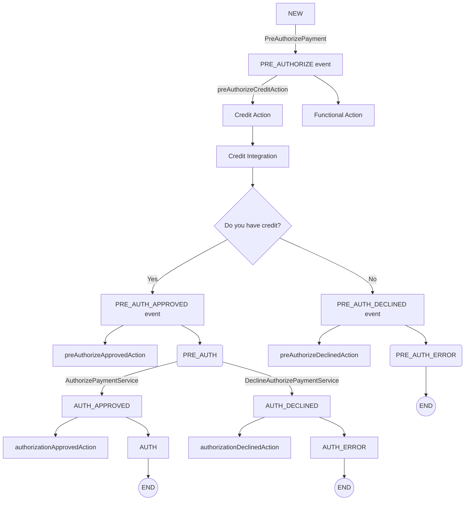

# Spring State Machine

```mermaid
flowchart TD
    A[NEW] --> |PreAuthorizePayment| B[PRE_AUTHORIZE event]
    B --> |preAuthorizeCreditAction| C[Credit Action]
    B --> D[Functional Action]
    C --> CI[Credit Integration]
    CI --> CI1{Do you have credit?}
    CI1 --> |Yes| CI1S[PRE_AUTH_APPROVED event]
    CI1S --> CI1S1[preAuthorizeApprovedAction]
    CI1 --> |No| CI1D[PRE_AUTH_DECLINED event]
    CI1D --> CI1D1[preAuthorizeDeclinedAction]
    CI1S --> C2S(PRE_AUTH)
    CI1D --> C2E(PRE_AUTH_ERROR)
    C2E --> PRE_AUTH_ERROR_END((END))
    C2S --> |AuthorizePaymentService| AUTH_APPROVED
    AUTH_APPROVED --> AUTH_APPROVED_ACTION[authorizationApprovedAction]
    AUTH_APPROVED --> AUTH
    AUTH --> AUTH_END((END))
    C2S --> |DeclineAuthorizePaymentService| AUTH_DECLINED
    AUTH_DECLINED --> AUTH_DECLINED_ACTION[authorizationDeclinedAction]
    AUTH_DECLINED --> AUTH_ERROR
    AUTH_ERROR --> AUTH_ERROR_END((END))
    
```
